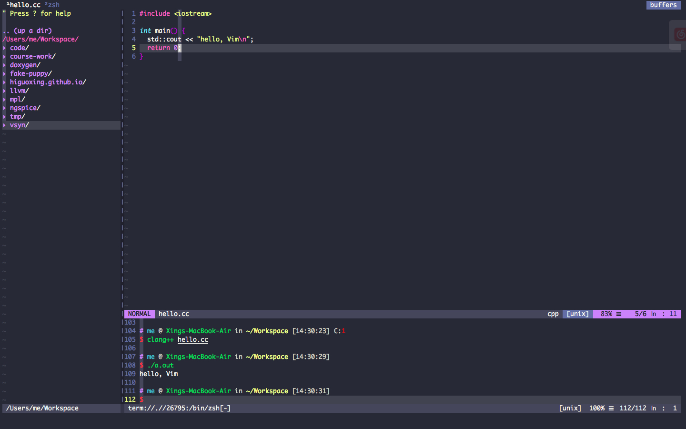
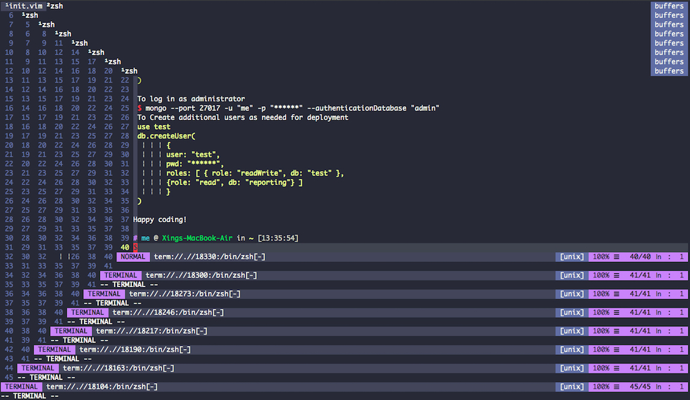

## 迁移到 [NeoVim]

很早就想尝试一下 `NeoVim` 了，因为每次配置 Vim 有点太烦了，而且这次直接换用了 Vim-Plug 的包管理，比起原来配置起来更方便了，而且更快了。初次尝试还是不错的，尤其是 NeoVim 有一个 `:terminal` 的命令，可以调出一个 Buffer 来容纳一个 Terminal Emulator ，这样调试程序就很方便了。但是在使用过程有个小小的不舒服的地方就是，当输入 exit 退出当前 Terminal 的时候，整个 NeoVim 都会退出，Google 了之后貌似是 Terminal 的Buffer 和 普通的 Buffer 不太一样，所以导致了这个奇怪的问题。

### Solution

一个解决方法是绑定一个打开 Terminal 的快捷键以及从 Terminal Mode 退出到 Normal Mode 的快捷键，这样有两个好处，一是能够利用自己舒服的键位打开命令行，二是直接退出到 Normal Mode 之后就可以按照正常的键位操作了，不是很麻烦。

```vim
" Terminal Config {
     tnoremap <Esc> <C-\><C-n>
     nnoremap <leader>o :below 10sp term://$SHELL<cr>i
" }
```

其它方面的东西可以在 NeoVim 内输入 `:help terminal-emulator` 进行查看。我的 NeoVim 配置在[这里](https://github.com/Higuoxing/dot-file/blob/master/.nvim/init.vim)

### Screenshot





最后，附一张我自己的 Vim ，并不需要配置很多插件，因为加载太多多插件后，我个人认为带来的好处并不能抵消它所带来启动缓慢的短处。顺便列举一些比较好用的插件

```vim
"===--------------------------------------------
" Tool Plugins
"===--------------------------------------------
Plug 'vim-airline/vim-airline'                          " airline 状态栏
Plug 'scrooloose/nerdtree'                              " 左侧栏的文件树，很好用
Plug 'yggdroot/indentline'                              " 就是图中的缩进提示线，可以替换成自己喜欢的字符
Plug 'majutsushi/tagbar', { 'on': 'TagbarToggle' }      " 标签栏，不多说了，用 Vim 都知道

"===--------------------------------------------
" Apperance Plugins
"===--------------------------------------------
Plug 'dracula/vim', { 'as': 'dracula' }  " dracula 主题，我最喜欢的暗色主题
Plug 'vim-airline/vim-airline-themes'    " 导航栏的主题，可有可无
Plug 'kien/rainbow_parentheses.vim'      " 🌈 括号，多括号的时候比较直观的看出来括号对
```
